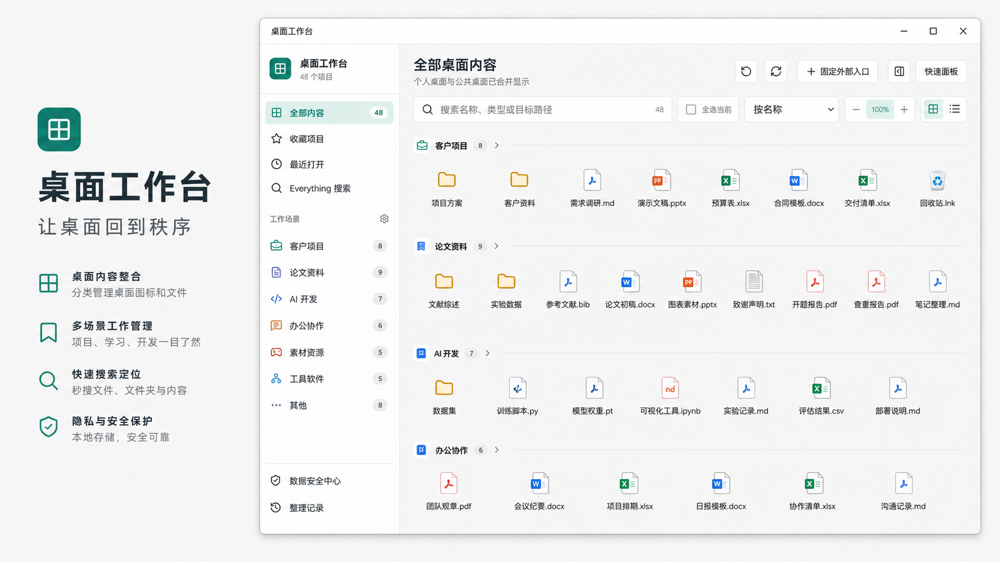
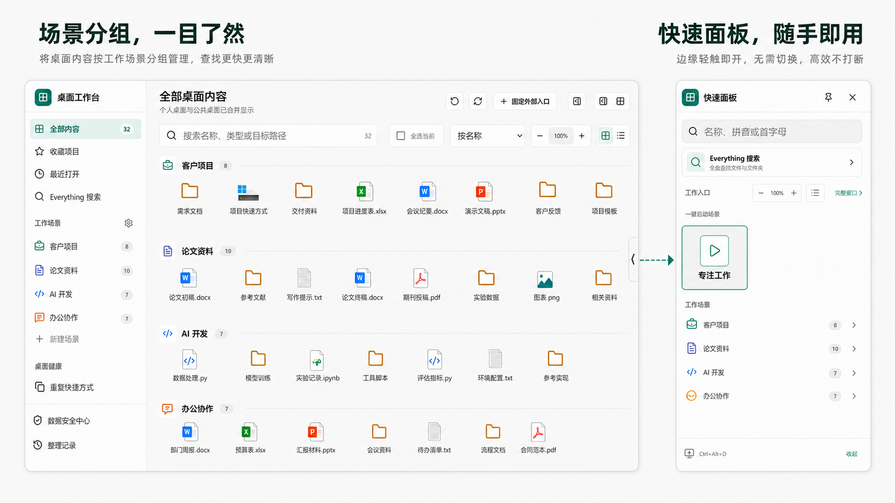

<div align="center">
  

  # 桌面工作台

  一款面向 Windows 的开源桌面图标与工作文件管理工具。用工作场景整理桌面，用快速面板启动常用项目，并在真正移动文件前提供完整预览与恢复保障。

  
  
  
  
  
</div>

> [!IMPORTANT]
> 桌面工作台默认只扫描和虚拟分类，不会因为启动应用而移动、覆盖或删除桌面文件。真实整理必须由用户选择项目并确认预览。

## 为什么做这个项目

Windows 桌面很容易同时堆积软件快捷方式、客户项目、论文资料、临时文档和下载文件。传统文件夹能收纳文件，却不适合快速启动和跨场景切换；普通启动器又很少关注真实文件整理的安全性。

桌面工作台把这两件事放在一起：

- **虚拟管理**：不改变桌面原始位置，也能分类、收藏、隐藏和排序。
- **快速启动**：主窗口和边缘快速面板都可以直接打开项目。
- **安全整理**：需要归档时先展示来源与目标，再执行可撤销移动。
- **全盘搜索**：可选接入 Everything，在应用内搜索本机文件。

## 功能一览

| 能力 | 说明 |
| --- | --- |
| 双桌面扫描 | 合并读取当前用户桌面与公共桌面，并明确标记来源 |
| 工作场景 | 自定义分类名称、颜色、顺序、智能规则、归档位置和启动步骤 |
| 分组总览 | “全部内容”按工作场景顺序分组，网格与列表视图都可用 |
| 快速面板 | 支持顶部、左侧、右侧外边缘停靠、自动隐藏、多显示器和热键唤出 |
| 图标管理 | 原生图标、后备图标、拖拽分类、图标排序、收藏、隐藏和批量操作 |
| 搜索 | 名称、路径、扩展名、拼音和拼音首字母即时搜索 |
| Everything 集成 | 在主窗口或快速面板内使用 Everything 搜索结果，不跳出应用 |
| 桌面健康 | 识别失效快捷方式、重复快捷方式、疑似重复和 SHA-256 精确重复文件 |
| 安全整理 | 整理预览、路径边界校验、重名自动编号、失败隔离和历史撤销 |
| 崩溃恢复 | 跨盘事务日志、复制校验、启动扫描和整理恢复中心 |
| 数据安全 | 设置导入导出、轮换备份、桌面快照与差异查看 |
| 显示调节 | 主窗口和快速面板独立缩放，支持按钮、`Ctrl+滚轮` 和一键恢复 100% |

## 工作场景与快速面板



### 工作场景

默认提供客户项目、论文与资料、AI 与开发、办公与沟通、工程工具、网络与远程等场景。所有场景均可新增、重命名、换色、排序或删除；手动分类始终优先于自动规则。

“全部内容”和快速面板使用同一场景顺序，每个分组显示颜色图标、名称和项目数量。点击分组标题即可进入对应场景。

### 快速面板

- 默认热键：`Ctrl+Alt+D`
- 列表和三列图标两种布局
- 搜索、场景筛选、拼音首字母和键盘启动
- 可停靠在显示器组合区域的最左、最右或各屏幕顶部外边缘
- 内部屏幕连接边不会触发停靠，避免面板藏在双屏缝隙
- 可调隐藏延时、触发区域、吸附距离和滑出速度
- 浮动状态不会自动隐藏，已停靠面板可轻松拖离

## 安全整理与搜索


### 文件安全模型

1. 真实整理只接受个人桌面第一层项目。
2. 执行前重新校验来源、目标和目录联接，拒绝路径穿越与符号链接逃逸。
3. 重名时自动生成带序号的新名称，绝不覆盖现有文件。
4. 同盘优先使用原子重命名；跨盘采用隔离源名称、复制、SHA-256 树校验和提交。
5. 每个跨盘阶段写入原子事务日志；断电或崩溃后，下次启动自动打开整理恢复中心。
6. 已验证的源副本通过 Windows 回收站处理，不做不可恢复删除。
7. 单项失败不会中断其他项目，历史记录支持指定撤销。

默认归档位置为：

```text
桌面\桌面归档\分类名称
```

### Everything 集成

Everything 为可选功能。本项目不会捆绑 Everything，也不会上传搜索内容。

1. 安装并启动 [Everything](https://www.voidtools.com/)。
2. 在桌面工作台中选择包含 `Everything.exe` 的目录。
3. 按提示下载 voidtools 官方 `ES.exe` 连接器。
4. 在主窗口或快速面板中直接搜索、打开或定位结果。

## 安装与运行

### 使用发布版本

从仓库的 [Releases](../../releases) 页面下载：

- `DesktopWorkspace-Setup-1.13.0-x64.exe`：安装版
- `DesktopWorkspace-Portable-1.13.0-x64.exe`：便携版

当前发布包未配置商业代码签名证书，Windows 首次运行可能显示 SmartScreen 提示。请只从本仓库 Releases 下载，并核对发布说明。

### 从源码运行

环境要求：

- Windows 10 或 Windows 11（x64）
- Node.js 22 或更高版本
- npm 10 或更高版本

```powershell
git clone https://github.com/liuchen796/desktop-workspace-manager.git
cd desktop-workspace-manager
npm.cmd install
npm.cmd run dev
```

### 构建 Windows 安装包

```powershell
npm.cmd run build
```

构建完成后，`release` 目录会生成 NSIS 安装版、便携版和 `win-unpacked` 免安装目录。

## 常用操作

- 双击项目或按 `Enter` 打开。
- 把单个或多选项目拖到左侧工作场景，仅修改虚拟分类。
- 在网格中把图标拖到另一个图标左右两侧，调整组内顺序。
- 点击项目悬停操作栏中的详情按钮，打开右侧预览。
- 按 `Ctrl+F` 搜索，`Ctrl+A` 全选当前结果，`F5` 刷新。
- 按住 `Ctrl` 滚动鼠标滚轮，调整主窗口或快速面板的图标与文字大小。
- 多选个人桌面项目后点击“整理到桌面归档”，先检查预览再确认。

## 数据存储与隐私

用户设置、分类、收藏、历史、备份、图标缓存和恢复日志保存在：

```text
%APPDATA%\DesktopWorkspaceManager
```

- 所有桌面扫描、图标解析、分类和搜索均在本机完成。
- 应用不提供云同步、遥测或账号系统。
- Everything 查询直接发送给本机 Everything 服务。
- 仓库不会包含用户设置、桌面索引、真实文件路径或测试截图。

## 技术架构

```text
src/                     React 用户界面与功能组件
electron/main.cjs        Electron 主进程入口与业务编排
electron/*-service.cjs   扫描、整理恢复、Everything、停靠、备份和 IPC 服务
electron/preload.cjs     contextBridge 安全 API
shared/                  可测试的分类、路径、整理、设置和快照逻辑
tests/                   Vitest 单元与集成测试
scripts/e2e.mjs          Playwright Electron 端到端测试
scripts/build-windows.mjs Windows 构建脚本
```

安全配置包括：

- `contextIsolation: true`
- Renderer 不直接访问 Node.js 或文件系统
- IPC 校验调用页面来源
- 文件操作串行化和桌面根目录约束
- 设置原子写入、迁移前副本和损坏文件隔离

## 测试

```powershell
npm.cmd run typecheck
npm.cmd test
npm.cmd run test:e2e
```

当前测试覆盖分类规则、稳定项目身份、设置迁移、路径边界、跨盘整理、事务恢复、撤销、快照、Everything、窗口停靠，以及主窗口与快速面板的完整交互。

## 常见问题

### 启动应用会自动移动桌面文件吗？

不会。首次扫描只建立索引。只有用户多选个人桌面项目、查看整理预览并确认后，才会真实移动。

### 公共桌面的快捷方式可以整理吗？

可以虚拟分类、收藏、隐藏和启动，但不会执行需要管理员权限的真实移动。

### 快速面板为什么不能停在双屏连接处？

应用只允许停靠在显示器组合区域的外部边缘，避免自动隐藏后无法顺利唤出。

### Everything 是必需的吗？

不是。桌面工作台自身的桌面搜索可以独立使用；Everything 仅用于可选的全盘高速搜索。

### 卸载应用会删除桌面文件吗？

不会。应用的用户数据与桌面真实文件相互独立。卸载前可从“数据安全中心”导出配置。

## 参与贡献

欢迎提交 Issue 和 Pull Request。开始前请阅读 [CONTRIBUTING.md](CONTRIBUTING.md)。安全问题请按照 [SECURITY.md](SECURITY.md) 私密报告。

## 开源许可

本项目使用 [MIT License](LICENSE)。Everything 与 ES.exe 的商标、软件和许可归 [voidtools](https://www.voidtools.com/) 所有，本项目与 voidtools 无隶属关系。

---

桌面工作台仍在持续完善。欢迎用真实工作流提出问题，让它成为更可靠、更顺手的 Windows 桌面工具。
